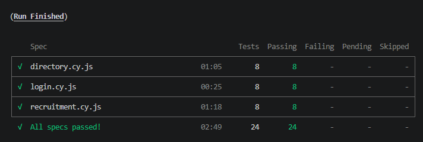
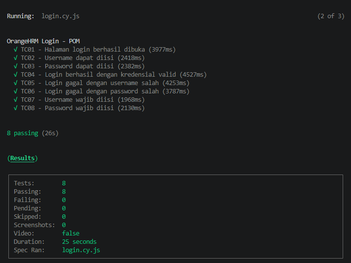
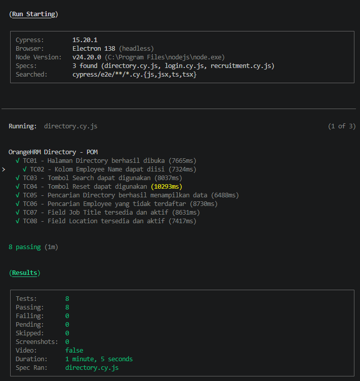
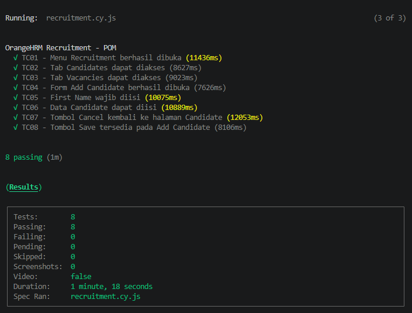

# OrangeHRM Cypress Automation


UI automation testing portfolio project for the **OrangeHRM Open Source Demo** using **Cypress** and **JavaScript**.

> **Portfolio Context**  
> This repository is a cleaned portfolio version of a QA Bootcamp final project.  
> The original learning repository is preserved separately as a bootcamp archive.  
> OrangeHRM is a public demo application, so shared data and application behavior may change between runs.

---

## Project Overview

This project demonstrates automated UI testing on the OrangeHRM Open Source Demo with a focus on reusable test architecture, maintainable test data, network validation, and clear execution evidence.

### Application Under Test

- **Application:** OrangeHRM Open Source Demo
- **Module Coverage:** Login, Directory, Recruitment
- **Testing Type:** UI Automation / End-to-End Testing
- **Execution Result:** **24 Passed / 0 Failed**
- **Framework:** Cypress 15.20.1
- **Language:** JavaScript

---

## Tech Stack

- Cypress 15.20.1
- JavaScript
- Node.js
- Page Object Model (POM)
- JSON Fixtures
- `cy.intercept()` for network validation
- Git
- GitHub
- VS Code

---

## Test Coverage

The project contains **24 automated test cases** across three specifications.

| Feature | Test Cases | Status | Main Coverage |
| --- | ---: | :---: | --- |
| Login | 8 | ✅ Passed | Page access, input fields, valid login, invalid credentials, required-field validation |
| Directory | 8 | ✅ Passed | Page access, employee input, search, reset, invalid employee, Job Title and Location fields |
| Recruitment | 8 | ✅ Passed | Module access, Candidates/Vacancies, Add Candidate, validation, candidate input, Cancel and Save |
| **Total** | **24** | **✅ All Passed** | **UI + network assertions** |

---

## Test Execution Evidence

All automated test specifications passed successfully.

- Login: 8 test cases
- Directory: 8 test cases
- Recruitment: 8 test cases
- Total: 24 automated test cases

### All Specs Passed



<details>
<summary><strong>View detailed execution evidence</strong></summary>

### Login — 8/8 Passed



### Directory — 8/8 Passed



### Recruitment — 8/8 Passed



</details>

---

## Project Structure

```text
orangehrm-cypress-automation/
├── cypress/
│   ├── e2e/
│   │   ├── login.cy.js
│   │   ├── directory.cy.js
│   │   └── recruitment.cy.js
│   │
│   ├── fixtures/
│   │   ├── loginData.json
│   │   ├── directoryData.json
│   │   └── recruitmentData.json
│   │
│   ├── pages/
│   │   ├── LoginPage.js
│   │   ├── DirectoryPage.js
│   │   └── RecruitmentPage.js
│   │
│   └── support/
│       └── e2e.js
│
├── evidence/
│   ├── all-spec-passed.png
│   ├── login.png
│   ├── directory.png
│   └── recruitment.png
│
├── scripts/
│   └── validate-portfolio.js
│
├── .gitignore
├── cypress.config.js
├── package.json
├── package-lock.json
└── README.md
```

---

## Test Architecture

### Page Object Model

Selectors and reusable page actions are separated from the test specifications.

```text
Test Spec
   ↓
Page Object
   ↓
OrangeHRM UI
```

This helps reduce duplicated selectors and makes test maintenance easier.

### Fixtures

Reusable test data is stored separately in JSON files:

```text
cypress/fixtures/
├── loginData.json
├── directoryData.json
└── recruitmentData.json
```

### Network Intercept

`cy.intercept()` is used to validate important network requests and responses alongside UI behavior.

Examples include:

- Directory employee search
- Directory reset request
- Recruitment candidate request
- Recruitment vacancy request
- Login-related network validation

---

## Automated Test Scenarios

### Login

The Login specification contains 8 automated scenarios covering:

1. Login page access
2. Username field behavior
3. Password field behavior
4. Login button availability
5. Successful login with valid credentials
6. Invalid username handling
7. Invalid password handling
8. Required-field validation

### Directory

The Directory specification contains 8 automated scenarios covering:

1. Directory page access
2. Employee Name field input
3. Search button and API response
4. Filter reset behavior and request validation
5. Directory data result validation
6. Invalid employee autocomplete validation
7. Job Title field availability
8. Location field availability

### Recruitment

The Recruitment specification contains 8 automated scenarios covering:

1. Recruitment module access
2. Candidates tab access
3. Vacancies tab access
4. Add Candidate form access
5. Required First Name validation
6. Candidate data input
7. Cancel action
8. Save button availability

---

## Installation

### Requirements

Before running the project, install:

- Node.js
- npm
- Git

Clone the repository:

```bash
git clone https://github.com/iqbalnhdyt/orangehrm-cypress-automation.git
```

Move into the project directory:

```bash
cd orangehrm-cypress-automation
```

Install dependencies:

```bash
npm install
```

---

## Running the Tests

### Open Cypress

```bash
npm run cy:open
```

Then select one of the specifications:

```text
login.cy.js
directory.cy.js
recruitment.cy.js
```

### Run All Tests Headlessly

```bash
npm run cy:run
```

or:

```bash
npm test
```

### Validate Portfolio Structure

```bash
npm run validate
```

Expected result:

```text
Portfolio validation PASSED
```

---

## Public Demo Limitations

OrangeHRM Open Source Demo is a shared public environment.

Because of this:

- test data may change;
- employee records may be different between executions;
- API response timing may vary;
- demo-side JavaScript behavior may occasionally change.

When shared demo data changes, the relevant fixture or test data should be reviewed rather than hiding the issue using broad exception suppression.

---

## QA Skills Demonstrated

This project demonstrates practical knowledge of:

- UI Automation Testing
- Cypress
- JavaScript
- End-to-End Testing
- Positive Testing
- Negative Testing
- Page Object Model
- Test Data Management using Fixtures
- Network Interception
- HTTP Response Validation
- Assertions
- Test Maintenance
- Git Version Control
- GitHub Repository Management
- QA Portfolio Documentation

---

## Portfolio Context

This project was developed from a **QA Bootcamp project** and then cleaned and improved as a dedicated QA Automation portfolio repository.

The portfolio version focuses on:

- clean repository structure;
- reusable Page Objects;
- separated fixture data;
- stable test assertions;
- network request validation;
- execution evidence;
- recruiter-friendly documentation.

### Related Repository

**Bootcamp Archive:**  
https://github.com/iqbalnhdyt/Sanbercode-Quality-Assurance

**Portfolio Repository:**  
https://github.com/iqbalnhdyt/orangehrm-cypress-automation

---

## Author

**Iqbal Nur Hidayat**

QA / Software Testing Portfolio

---

## Test Status

**✅ 24 Automated Test Cases Passed**

```text
Login        : 8 Passed
Directory    : 8 Passed
Recruitment  : 8 Passed
-----------------------
Total        : 24 Passed
Failed       : 0
```
